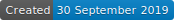

# Carousel in Vanilla JS

  

A Carousel created only with Vanilla JS (Zero library)

## To start

Nothing needed to start, only download this repository or open it with the link in the description !

### Prerequisites

If you want to edit it, you need beforehand a code editor like Visual Studio Code, Sublime Text, Atom, ...

### Delivery conditions

#### Base

* Change image with each click on the button
* Image list (```<li>```)
* Vanilla JS only (No library or Copy/Paste)

#### Bonus

* Real pictures
* Put Next and Previous Options
* Display of the number of images (1 point per image) with highlighting of the active image
* Dark mode

[PDF of the delivery conditions (in French)](https://github.com/yes-we-web/livraisonsolo/blob/master/livraison-solo-05.pdf)

## Made with

* [Visual Studio Code](https://code.visualstudio.com) - Code Editor

## Contributors

* **Dylan Vienne** _alias_ [@sinhast](https://github.com/sinhast?tab=repositories)

## License

No License applied to this project.
